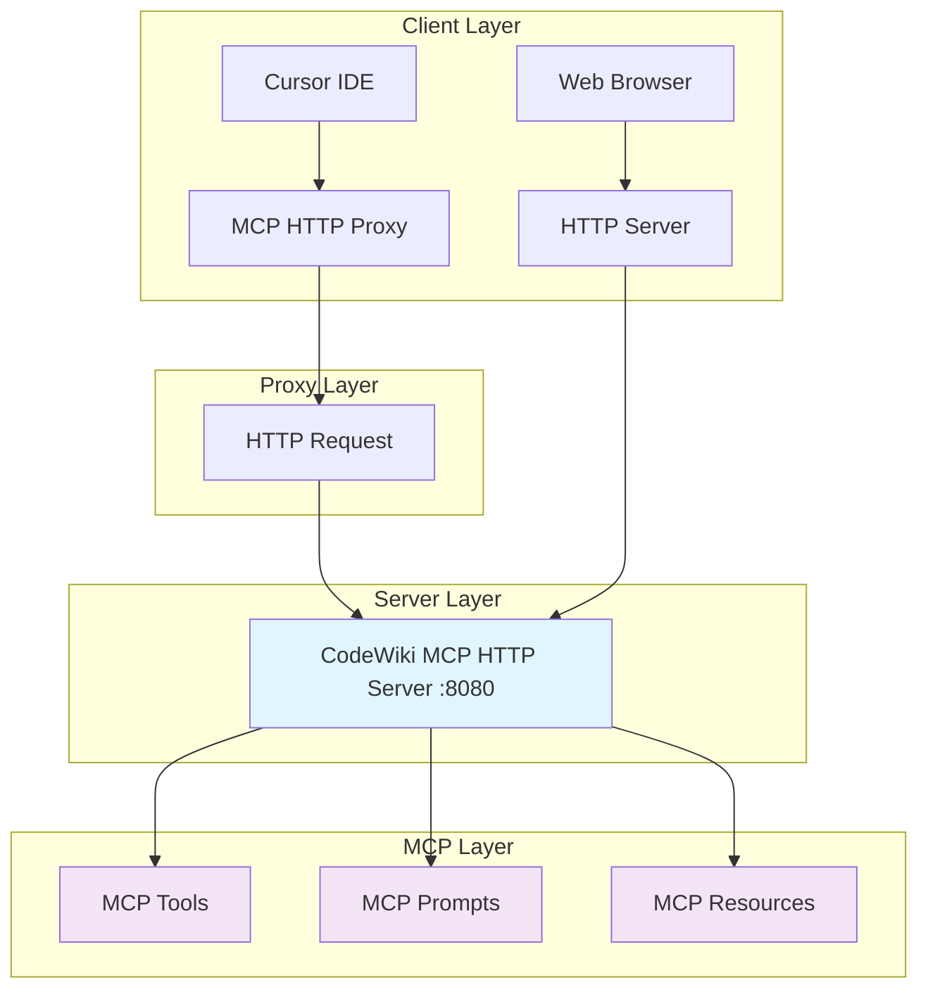

# CodeWiki HTTP MCP Server 配置指南

## 概述

CodeWiki HTTP MCP Server 在端口 8080 上提供 HTTP 接口，支持通过 HTTP 协议与 MCP 客户端通信。

## 快速启动

### 1. 启动 HTTP MCP 服务器

```bash
# Windows
scripts/start-mcp-http.bat

# Linux/macOS
go build -o bin/mcp-http ./cmd/mcp-http
./bin/mcp-http
```

### 2. 验证服务器运行

访问以下 URL 验证服务器状态：

- **健康检查**: http://localhost:8080/health
- **Web 界面**: http://localhost:8080/
- **MCP 端点**: http://localhost:8080/mcp

## 配置 Cursor MCP

### 1. 更新 Cursor 配置

编辑 `~/.cursor/mcp.json` 文件：

```json
{
  "mcpServers": {
    "codewiki": {
      "command": "node",
      "args": ["D:/workspace/github/codewiki/scripts/mcp-http-proxy.js"]
    }
  }
}
```

### 2. 重启 Cursor

重启 Cursor 后，MCP 服务器将通过 HTTP 代理连接到 CodeWiki 服务。

## API 接口

### MCP 端点

**POST** `/mcp`

MCP 协议的主要端点，支持以下操作：

#### 工具调用

```json
{
  "jsonrpc": "2.0",
  "id": 1,
  "method": "tools/call",
  "params": {
    "name": "list_repositories",
    "arguments": {}
  }
}
```

#### 可用工具

1. **hello** - 问候工具
   ```json
   {
     "name": "hello",
     "arguments": {
       "name": "World"
     }
   }
   ```

2. **list_repositories** - 列出仓库
   ```json
   {
     "name": "list_repositories",
     "arguments": {}
   }
   ```

3. **create_repository** - 创建仓库
   ```json
   {
     "name": "create_repository",
     "arguments": {
       "name": "my-repo",
       "path": "/path/to/repo"
     }
   }
   ```

### 健康检查端点

**GET** `/health`

返回服务器状态信息：

```json
{
  "status": "ok",
  "service": "codewiki-mcp-http"
}
```

## 测试工具

### 1. 使用 curl 测试

```bash
# 健康检查
curl http://localhost:8080/health

# 测试 MCP 工具调用
curl -X POST http://localhost:8080/mcp \
  -H "Content-Type: application/json" \
  -d '{
    "jsonrpc": "2.0",
    "id": 1,
    "method": "tools/call",
    "params": {
      "name": "hello",
      "arguments": {"name": "CodeWiki"}
    }
  }'
```

### 2. 使用测试脚本

```bash
# 运行测试脚本
node scripts/test-mcp-http.js
```

## 架构图



## 故障排除

### 常见问题

1. **端口 8080 被占用**
   ```bash
   # 检查端口占用
   netstat -ano | findstr :8080
   
   # 杀死占用进程
   taskkill /PID <PID> /F
   ```

2. **MCP 代理连接失败**
   - 确保 HTTP 服务器正在运行
   - 检查代理脚本路径是否正确
   - 验证端口 8080 是否可访问

3. **工具调用失败**
   - 检查请求格式是否正确
   - 查看服务器日志
   - 验证 Content-Type 头

### 日志查看

服务器日志会直接输出到控制台，包括：
- 启动信息
- 请求日志
- 错误信息

## 开发指南

### 添加新工具

1. 在 `cmd/mcp-http/main.go` 中注册工具：

```go
server.RegisterTool("my_tool", "My tool description", func(args map[string]interface{}) (*mcp_golang.ToolResponse, error) {
    // 实现工具逻辑
    return mcp_golang.NewToolResponse(mcp_golang.NewTextContent("Tool result")), nil
})
```

2. 重启服务器

3. 测试工具调用

### 自定义端口

修改 `cmd/mcp-http/main.go` 中的端口：

```go
httpTransport.WithAddr(":9090") // 改为端口 9090
```

同时更新代理脚本中的端口配置。

## 安全考虑

- HTTP 服务器默认绑定到所有接口 (0.0.0.0)
- 生产环境建议添加认证和 HTTPS
- 考虑添加请求限制和日志记录

## 性能优化

- 使用连接池
- 添加缓存机制
- 实现请求限流
- 监控服务器性能
