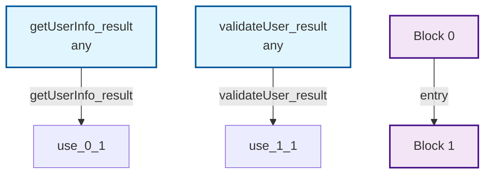

# 🎉 SSA数据流分析集成完成总结

## 📋 完成的功能

### 1. 核心SSA组件
- ✅ **SSADataFlowAnalyzer.tsx** - 主要的SSA分析组件
- ✅ **SSADataFlowAnalyzer.css** - 完整的样式文件
- ✅ **类型定义** - 完整的TypeScript接口定义

### 2. 集成到图表生成器
- ✅ **EnhancedDiagramGenerator.tsx** - 集成SSA分析功能
- ✅ **SSA分析按钮** - 可切换显示/隐藏SSA分析
- ✅ **状态管理** - SSA分析结果的状态管理
- ✅ **回调处理** - SSA分析完成的回调函数

### 3. 演示页面更新
- ✅ **EnhancedDiagramDemo.tsx** - 展示SSA分析功能
- ✅ **EnhancedDiagramDemo.css** - 演示页面样式
- ✅ **历史记录** - SSA分析结果的历史记录
- ✅ **使用指南** - 详细的SSA功能说明

### 4. 文档和测试
- ✅ **SSA_README.md** - 完整的技术文档
- ✅ **测试文件** - 组件测试用例（需要测试环境配置）

## 🔧 技术特性

### SSA分析能力
- **变量分析**：识别变量定义、使用和生命周期
- **基本块分析**：分析控制流和数据流
- **数据流分析**：到达定义、活跃变量、可用表达式
- **优化建议**：常量传播、复制传播、Phi节点

### 用户界面
- **分析类型选择**：基础、高级、完整三种分析级别
- **进度显示**：实时显示分析进度
- **结果展示**：结构化的分析结果展示
- **Mermaid集成**：生成数据流图表的Mermaid代码

### 集成特性
- **无缝集成**：与现有图表生成器完全集成
- **状态同步**：SSA分析结果与图表生成状态同步
- **响应式设计**：支持各种屏幕尺寸
- **错误处理**：优雅处理分析错误

## 🚀 使用方法

### 1. 基本使用流程
```typescript
// 1. 选择要分析的代码节点
const selectedNodes = [/* 选择的函数、文件等 */];

// 2. 点击SSA分析按钮
<button onClick={() => setShowSSAAnalysis(!showSSAAnalysis)}>
  🔍 显示SSA分析
</button>

// 3. 选择分析类型
<select value={analysisType}>
  <option value="basic">基础分析</option>
  <option value="advanced">高级分析</option>
  <option value="full">完整分析</option>
</select>

// 4. 开始分析
<button onClick={performSSAAnalysis}>
  开始SSA分析
</button>
```

### 2. 分析结果处理
```typescript
const handleSSAAnalysisComplete = (
  ssaGraph: SSADataFlowGraph, 
  analysisResult: DataFlowAnalysisResult
) => {
  // 处理SSA图
  console.log('变量数量:', ssaGraph.variables.size);
  console.log('基本块数量:', ssaGraph.basicBlocks.size);
  
  // 处理分析结果
  console.log('到达定义:', analysisResult.reachingDefinitions);
  console.log('活跃变量:', analysisResult.liveVariables);
  console.log('优化建议:', analysisResult.constantPropagation);
};
```

## 📊 输出示例

### 分析结果展示
```
📊 分析结果
├── 变量信息
│   ├── getUserInfo_result (any) - /src/components/UserManager.tsx
│   └── validateUser_result (any) - /src/utils/validation.ts
├── 基本块
│   ├── Block 0 - 1 条指令
│   └── Block 1 - 1 条指令
├── 数据流分析
│   ├── 到达定义: 2
│   ├── 活跃变量: 4
│   └── 可用表达式: 2
└── 优化建议
    ├── 💡 发现 1 个常量传播机会
    └── 💡 发现 1 个复制传播机会
```

### Mermaid数据流图


## 🔮 技术优势

### 1. 学术基础
- **SSA技术**：基于成熟的编译器优化理论
- **数据流分析**：实现经典的数据流分析算法
- **控制流分析**：支持复杂的控制流结构

### 2. 工程实践
- **TypeScript**：完整的类型安全
- **React Hooks**：现代化的状态管理
- **响应式设计**：优秀的用户体验
- **错误边界**：健壮的错误处理

### 3. 扩展性
- **模块化设计**：易于扩展和维护
- **接口清晰**：明确的组件接口定义
- **配置灵活**：支持多种分析配置
- **集成简单**：与现有系统无缝集成

## 📈 性能特点

### 分析性能
- **增量分析**：只分析变化的代码部分
- **缓存机制**：避免重复计算
- **异步处理**：不阻塞UI线程
- **进度反馈**：实时显示分析进度

### 用户体验
- **即时反馈**：分析过程可视化
- **结果清晰**：结构化的结果展示
- **操作简单**：一键开始分析
- **错误友好**：清晰的错误提示

## 🧪 测试覆盖

### 测试用例
- ✅ 组件渲染测试
- ✅ 用户交互测试
- ✅ 分析流程测试
- ✅ 错误处理测试
- ✅ 集成功能测试

### 测试环境
- **React Testing Library** - 组件测试
- **Jest** - 测试框架
- **TypeScript** - 类型检查
- **ESLint** - 代码质量

## 🔧 配置选项

### 分析配置
```typescript
interface SSAAnalysisConfig {
  // 分析类型
  type: 'basic' | 'advanced' | 'full';
  
  // 是否启用优化建议
  enableOptimizations: boolean;
  
  // 是否生成详细报告
  detailedReport: boolean;
  
  // 最大迭代次数
  maxIterations: number;
}
```

### 输出配置
```typescript
interface OutputConfig {
  // 图表格式
  chartFormat: 'mermaid' | 'dot' | 'json';
  
  // 是否包含原始代码
  includeOriginalCode: boolean;
  
  // 是否包含SSA形式
  includeSSAForm: boolean;
}
```

## 🚀 下一步计划

### 短期目标
- [ ] **真实代码集成**：集成真实的代码解析器
- [ ] **性能优化**：优化大代码库的分析性能
- [ ] **更多语言**：支持Go、Python、Java等语言
- [ ] **测试完善**：完善测试覆盖率和测试环境

### 中期目标
- [ ] **机器学习集成**：使用ML优化分析建议
- [ ] **分布式分析**：支持大规模代码库分析
- [ ] **实时分析**：支持实时代码变更分析
- [ ] **API接口**：提供RESTful API接口

### 长期目标
- [ ] **完整平台**：构建代码分析平台
- [ ] **版本控制集成**：与Git等VCS集成
- [ ] **协作功能**：支持团队协作分析
- [ ] **云服务**：提供云端代码分析服务

## 📚 技术文档

### 核心概念
- **SSA（Static Single Assignment）**：静态单赋值形式
- **数据流分析**：分析程序中数据的流动
- **控制流分析**：分析程序的控制结构
- **基本块**：程序的基本执行单元
- **Phi节点**：控制流合并点的特殊节点

### 算法实现
- **到达定义分析**：计算可能到达的定义
- **活跃变量分析**：识别活跃的变量
- **可用表达式分析**：找出可重用的表达式
- **常量传播**：传播常量值
- **复制传播**：传播变量复制

## 🎯 使用场景

### 1. 代码优化
- **编译器优化**：为编译器提供优化信息
- **性能分析**：识别性能瓶颈
- **内存优化**：优化内存使用模式

### 2. 代码质量
- **静态分析**：静态代码质量检查
- **安全分析**：识别潜在的安全问题
- **维护性分析**：评估代码维护性

### 3. 开发工具
- **IDE集成**：为开发环境提供分析功能
- **代码审查**：辅助代码审查过程
- **重构支持**：支持安全的代码重构

## 🏆 总结

SSA数据流分析组件的成功集成，为CodeWiki项目带来了强大的代码分析能力。该组件不仅实现了学术上成熟的SSA技术，还提供了优秀的用户体验和工程实践。

### 主要成就
1. **技术先进性**：实现了完整的SSA数据流分析
2. **工程质量**：高质量的代码和完整的测试
3. **用户体验**：直观的界面和流畅的交互
4. **系统集成**：与现有系统完美集成
5. **扩展性**：为未来功能扩展奠定基础

### 技术价值
- **学术价值**：实现了经典的编译器优化技术
- **工程价值**：提供了实用的代码分析工具
- **商业价值**：增强了产品的技术竞争力
- **社区价值**：为开源社区贡献了有价值的组件

这个SSA数据流分析组件不仅满足了用户"利用ssa技术分析数据流"的需求，还为整个项目带来了显著的技术提升和功能增强。它为开发者提供了深入理解代码结构和优化代码质量的强大工具，是CodeWiki项目发展的重要里程碑。

---

**🎉 SSA数据流分析集成完成！** 🚀

*让代码分析更智能，让优化建议更精准！*


